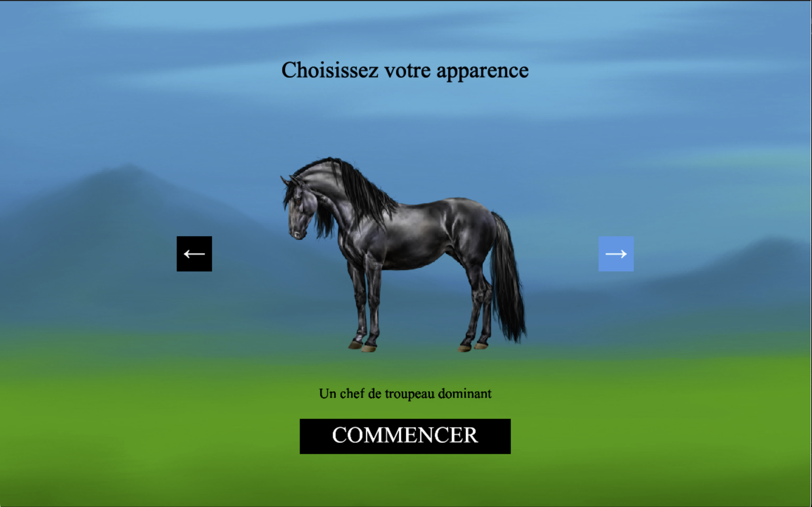

# MINDHeard - Dynamiques sociales équines



# Description

Dans MINDHeard, vous incarnez un cheval au sein d’un troupeau sauvage, évoluant dans un monde où chaque action chaque choix, influence la cohésion, la survie et l’équilibre du troupeau. Vous serez confronté·e à des dilemmes: fuir ou protéger ? Suivre ou guider ? Isoler ou rassembler ? Chacun de vos choix façonnera le destin du troupeau… et vous enseignera les dynamiques 
sociales équines. 


## Installation et lancement

1. Clonez ce dépôt :
```bash
git clone ... 
```


## Sources

Développé avec le framework Kaplay

Musique et sons : Freesound.org et pixabay.com

Images: OpenGameArt.org et pngkit.com

Documentation éthologique : 

- BOURJADE M., 2007. Sociogenèse et expression des comportements individuels et collectifs chez le cheval. Thèse de doctorat, Université Louis Pasteur.

- JORGENSEN G.H.M., BORSHEIM L., MEJDELL C.M., SONDERGAARD E. et BOE K.E., 2009. Grouping horses according to gender - Effects on aggression, spacing
and injuries. Applied Animal Behaviour Science, 120(1-2), pages 94-99


## Dépendances et technologies utilisées

- [Kaplay](https://unpkg.com/kaplay@3001/dist/kaplay.js) - Bibliothèque pour la visualisation interactive
- HTML5
- CSS
- JavaScript
- Visual Studio Code
- Utilisation de ChatGPT pour la gestion d'erreur 


## Contexte de développement
Ce projet a été développé dans le cadre du cours Jeu vidéo 2D dispensé par Isaac Pante (SLI, Lettres, UNIL).